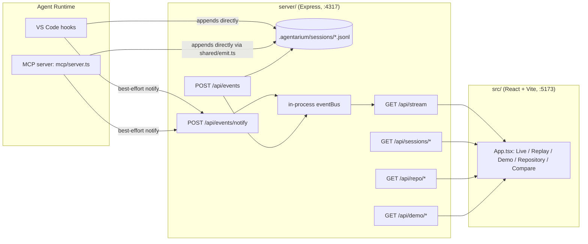

# Architecture

## Overview



## The event model (`shared/events.ts`)

Every observation in the system — regardless of source — is normalized into
one `AgentariumEvent` shape (Zod-validated):

```ts
{
  id, sessionId, timestamp, type, actor?, parentId?,
  source: "hook" | "mcp" | "filesystem" | "agent-declared" | "system" | "demo",
  evidence: "observed" | "declared" | "inferred",
  label, metadata?, raw?
}
```

`source` and `evidence` compose rather than duplicate: `source: "demo"` marks
*where the recording came from*, while `evidence` still reflects what kind of
observation it originally was (usually `"observed"`, since demo traces are
built from realistic event sequences, not fabricated summaries).

`createEvent()` is the only supported way to build an event outside of
`JSON.parse`. It runs `checkEvidenceConsistency()`, which hard-fails if:

- an event type that must always be verifiable (`agent.started`, `file.read`,
  `mcp.tool.called`, `validation.*`, etc. — see `NEVER_INFERRED_TYPES`) is
  marked `evidence: "inferred"`,
- `skill.inferred` is marked anything other than `"inferred"`,
- `decision.declared` is marked anything other than `"declared"`.

This is the single mechanism that keeps the whole system honest: it is
structurally impossible to accidentally display a guess as a fact.

## Event sources, in detail

### 1. Hooks (`scripts/agentarium-hook.mjs`)

A single dependency-free Node script wired to 8 VS Code agent hook events via
`.github/hooks/agentarium.json`: `SessionStart`, `UserPromptSubmit`,
`PreToolUse`, `PostToolUse`, `SubagentStart`, `SubagentStop`, `PreCompact`,
`Stop`. It reads the hook's JSON payload from stdin, maps it to one or more
`AgentariumEvent`s, and:

1. Appends them to `.agentarium/sessions/<sessionId>.jsonl` itself
   (this is the durable source of truth — it must work even if no dashboard
   is running).
2. Best-effort `fetch()`-POSTs them to the collector's
   `/api/events/notify` endpoint purely so a *currently open* dashboard can
   show them live, with a short timeout and silent failure if the collector
   isn't running.

It also classifies well-known file-operation tool names
(`read_file`/`get_errors` → `file.read`; `create_file`/`replace_string_in_file`/
`multi_replace_string_in_file`/`edit_notebook_file` → `file.written`;
`grep_search`/`file_search`/`semantic_search`/`list_dir` → `file.searched`)
and emits the more specific `file.*` event type alongside the generic
`tool.completed`, since this deterministic name→category mapping is exactly
as "observed" as the tool call itself.

The script always exits `0` with `{ continue: true }` — a bug in
observability must never block or crash the agent it's observing.

### 2. MCP server (`mcp/server.ts`)

Built on `@modelcontextprotocol/sdk` (`McpServer` + `StdioServerTransport`),
registered in `.vscode/mcp.json`. Exposes:

**Tools**
- `inspect_world` — read-only world summary (counts per domain).
- `validate_world` — runs the real deterministic validator, emits real
  `validation.started`/`validation.passed`/`validation.failed` events.
- `find_dependencies` — cross-reference scanner: what an entity ID exists as,
  and everything that references it.
- `trace_decision` — the decision-telemetry tool. Lets an agent
  record `{decision, reason, next?, alternatives?, confidence?}` as a real
  `decision.declared` event (`source: "agent-declared"`, `evidence: "declared"`).
- `simulate_change` (optional/bonus) — dry-run patch validation against a
  hypothetical merged world, without writing to disk.

**Resources**
- `world://summary`, `world://institutions`, `world://relationships`, `world://history`.

`mcp/telemetry.ts`'s `withToolTelemetry()` wraps every tool (except
`trace_decision`, which emits its own more specific event) so every call
becomes an `mcp.tool.called` event, and every resource read becomes
`mcp.resource.read` — both `source: "mcp"`, `evidence: "observed"`.

The MCP server runs as its own process, so it follows the same
append-locally-then-notify pattern as the hook script, via the shared
`shared/emit.ts` helper (`recordAndNotify()`).

### 3. The collector (`server/collector.ts` + `server/index.ts`)

- `POST /api/events` — full ingest path (`ingestEvent`): validate, redact,
  append to JSONL, publish to the in-process bus. Reserved for producers that
  have **not** already persisted themselves, e.g. `POST /api/dev/emit`
  (manual event injection for local development).
- `POST /api/events/notify` — broadcast-only: validate, redact, publish — no
  append. Used by the hook script and the MCP server, which already wrote to
  disk themselves. This split exists specifically to avoid duplicate JSONL
  lines when the collector happens to be running at the same time as a
  writer that persists on its own.
- `GET /api/stream` — SSE. Optional `?sessionId=` filter.
- `GET /api/sessions`, `GET /api/sessions/:id/events` (optional `?upTo=` for
  replay scrubbing), `GET /api/sessions/:id/metrics`.
- `GET /api/repo/{agents,skills,prompts}` — reads `.github/agents/*.agent.md`,
  `.github/skills/*/SKILL.md`, `.github/prompts/*.prompt.md` off disk and
  extracts `name`/`description` from their frontmatter with a small regex
  reader (deliberately not a full YAML parser, to avoid a dependency for two
  string fields).
- `GET /api/demo`, `GET /api/demo/:name/events` — lists/reads `demo/*.jsonl`.

### 4. Redaction (`shared/redaction.ts`)

Every event is passed through `redactEventPayload()` before it is persisted
or broadcast — this strips things that look like secrets (API keys, tokens,
common credential patterns) out of event metadata/labels before they ever
reach disk or the network.

## Metrics (`shared/metrics.ts`)

`computeSessionMetrics()` derives everything the Compare view shows purely by
folding over a session's event list: duration (first→last timestamp),
distinct agents/subagents, distinct files read/written, distinct tools used
and total tool-call count, distinct Skills accessed vs. inferred, validation
pass/fail counts, and a "repair loop" count (a contiguous run starting with a
validation failure and ending in a validation pass counts as one loop, not
one per failure). Nothing here touches an LLM — it's pure reduction over
already-observed events, which is what makes the Compare view trustworthy.

## Frontend (`src/`)

- `api/client.ts` — typed `fetch` wrappers over the REST API.
- `api/useEventStream.ts` — SSE hook; exposes accumulated events and an
  honest `connected` boolean (never fakes a connected state).
- `graph/EventGraph.tsx` — folds the event list into actor/tool/Skill/MCP
  nodes and edges (aggregated, with call counts) and renders them with
  `@xyflow/react`. Rebuilt via `useMemo` whenever the event list changes, so
  the graph is always a pure function of the observed events, not a
  separately-maintained state machine that could drift from the log.
- `timeline/Timeline.tsx` — chronological list with provenance badges
  (`observed`/`declared`/`inferred`/`demo`, plus a restrained-red badge for
  `*.failed` events).
- `inspector/Inspector.tsx` — the raw-evidence view: full JSON of the
  selected event plus a plain-language explanation of its evidence level.
- `panels/ActivityPanel.tsx` — live tallies (agents/Skills/tools/files) from
  whatever event set is currently visible.
- `panels/RepositoryPanel.tsx` — the static authored-artifact catalog
  (agents/Skills/prompts), independent of usage.
- `panels/ComparePanel.tsx` — the run-comparison table described above.
- `styles/theme.css` — the "museum of computation + botanical specimen
  cabinet + strange government observatory" visual language: paper
  neutrals, charcoal, dusty green, amber, muted violet, restrained red,
  monospace telemetry text, a subtle grid texture. Deliberately not a
  generic dark-mode AI dashboard.

## Testing (`tests/`, Vitest)

- `events.test.ts` — schema validation + `checkEvidenceConsistency` rules.
- `event-store.test.ts` — JSONL append/read/list/`eventsUpTo` round-trips.
- `redaction.test.ts` — secret-shaped strings are actually stripped.
- `metrics.test.ts` — `computeSessionMetrics` against constructed event
  sequences, including a multi-failure repair loop.
- `world-validator.test.ts` — both passing and deliberately-broken world
  fixtures, since the validator must be able to fail on purpose.

All tests are deterministic: no wall-clock dependence, no network, no real
`.agentarium/` directory (temp dirs only) — see
`.github/instructions/tests.instructions.md`.

## Provenance, honestly

AGENTARIUM never claims to expose an agent's private chain-of-thought. What
it shows is: what tools/files/Skills were touched (observed), what the agent
chose to explicitly declare about its own reasoning via
`trace_decision` (declared, and visibly labeled as self-reported),
occasional best-effort inference from indirect signals (inferred, and
visibly labeled as a guess), and prerecorded traces (demo, always banner-
labeled). This distinction is enforced in the data model
(`checkEvidenceConsistency`), not just in UI copy.
