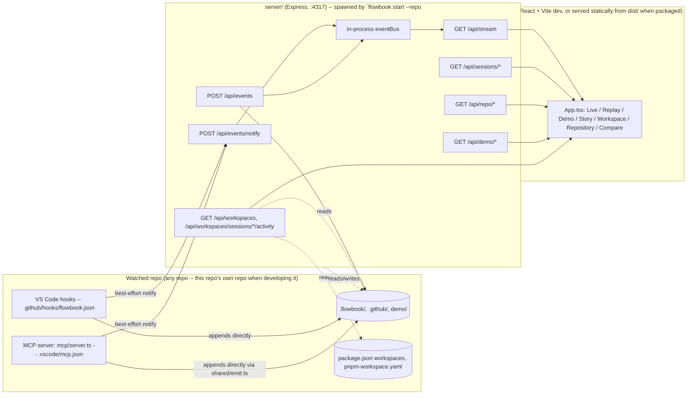

# Architecture

## Overview



`shared/paths.ts` is what makes this repo-agnostic: `REPO_ROOT` (the repo
being watched, from `FLOWBOOK_REPO_ROOT`/cwd) is where `.flowbook/`,
`.github/`, and `demo/` are read/written; `PACKAGE_ROOT` (this package's own
install directory) is only used to find the built dashboard (`dist/`) to
serve statically. They're the same directory only when running this repo's
own `npm start`.

## The event model (`shared/events.ts`)

Every observation in the system — regardless of source — is normalized into
one `FlowbookEvent` shape (Zod-validated):

```ts
{
  id, sessionId, timestamp, type, actor?, parentId?,
  source: "hook" | "mcp" | "filesystem" | "agent-declared" | "system" | "demo",
  evidence: "observed" | "declared" | "inferred",
  label, metadata?, raw?
}
```

`source` and `evidence` compose rather than duplicate: `source: "demo"` marks
*where the recording came from*, while `evidence` still reflects what kind of
observation it originally was (usually `"observed"`, since demo traces are
built from realistic event sequences, not fabricated summaries).

`createEvent()` is the only supported way to build an event outside of
`JSON.parse`. It runs `checkEvidenceConsistency()`, which hard-fails if:

- an event type that must always be verifiable (`agent.started`, `file.read`,
  `mcp.tool.called`, `validation.*`, etc. — see `NEVER_INFERRED_TYPES`) is
  marked `evidence: "inferred"`,
- `skill.inferred` is marked anything other than `"inferred"`,
- `decision.declared` is marked anything other than `"declared"`.

This is the single mechanism that keeps the whole system honest: it is
structurally impossible to accidentally display a guess as a fact.

## Event sources, in detail

### 1. Hooks (`scripts/flowbook-hook.mjs` + `scripts/hook-pipeline.mjs`)

Wired to 8 VS Code agent hook events via the watched repo's
`.github/hooks/flowbook.json` (scaffolded there by
`flowbook init`): `SessionStart`, `UserPromptSubmit`,
`PreToolUse`, `PostToolUse`, `SubagentStart`, `SubagentStop`, `PreCompact`,
`Stop`. Split across two dependency-free Node files:

- **`flowbook-hook.mjs`** — the thin, shebang'd entry point VS
  Code actually spawns. Owns only stdin/stdout/exit-code I/O: read the raw
  hook JSON off stdin, hand it to `processHookInput()`, then always write
  `{ continue: true }` to stdout and exit `0` — a bug in observability must
  never block or crash the agent it's observing.
- **`hook-pipeline.mjs`** — every actual behavior: normalize, correlate,
  route, and persist. Kept in a separate (shebang-free) file specifically
  so it can be `import`ed directly by unit tests (`tests/flowbook-hook.test.ts`)
  — Vite's import-analysis (which Vitest uses) cannot parse a module
  starting with a `#!` line, even though Node itself runs shebang'd files
  fine, so the shebang stays confined to the entry point that tests never
  import.

**Pipeline shape.** One hook invocation flows through four stages instead
of one independent code path per hook name:

```text
   stdin JSON
       │
       ▼
 normalizeHookEvent()      raw VS Code payload -> a plain, state-free
                           lifecycle descriptor (hook name, tool/agent
                           identifiers, timestamps)
       │
       ▼
 buildEventsForHook()      combines the descriptor with the session's
  (correlate + route)      persisted turn/agent state to decide which
                           FlowbookEvent(s) this firing produces, and
                           how state changes as a result. Pure function:
                           same inputs always produce the same output.
       │
       ▼
 finalizeEvent()           fills in id/timestamp defaults, redacts
       │
       ▼
 appendEvents() +          the existing dual-write: append to this
 postToCollector()         session's JSONL (durable, source of truth),
                           then best-effort notify a live collector
```

**Correlation state (`.flowbook/current-session.json`).** This file
already existed purely as a "which session is current" pointer (read by
`server/session.ts`). It's extended — not replaced, and not moved to a new
file or database — to also carry:

- `turnSeq` / `currentTurnId` — a hook-local turn counter. VS Code does not
  supply its own turn id, so this is deliberately locally-derived, not
  something observed from VS Code itself.
- `agentStack` — the stack of currently-open subagents (pushed on
  `SubagentStart`, popped on `SubagentStop`), each frame carrying the real
  event id of its own `subagent.started` event. This is what lets a nested
  subagent-of-a-subagent, or a tool call made while a subagent is active,
  carry a real `parentId` back to whatever actually spawned it — instead of
  every subagent/tool event being silently attributed to one flat "main
  agent" lane. `parentId` is an existing `FlowbookEventSchema` field that
  had no producer before this change (see `shared/events.ts`) — no schema
  migration was needed to add this.

`server/session.ts` only ever reads the `sessionId` field back out of this
file, so the extra fields are additive and harmless to that consumer.

**File-operation classification.** Well-known VS Code tool names are
mapped to more specific `file.*` types deterministically
(`read_file`/`get_errors` → `file.read`; `create_file`/`replace_string_in_file`/
`multi_replace_string_in_file`/`edit_notebook_file` → `file.written`;
`grep_search`/`file_search`/`semantic_search`/`list_dir` → `file.searched`),
emitted alongside the generic `tool.completed`/`tool.failed` — this
name→category mapping is exactly as "observed" as the tool call itself. A
failed tool call never gets a `file.*` event: attributing a completed file
read/write/search to a call that actually failed would falsely claim the
operation succeeded.

**Known VS Code limitations (real, and documented rather than papered
over):**

- **No dedicated tool-failure hook.** `PostToolUse` fires the same way
  whether the tool call succeeded or failed. The pipeline best-effort
  detects failure by inspecting common error-shaped fields on
  `tool_response` (`isError`/`is_error`/`error` — the same convention this
  repo's own MCP tools use, see `mcp/telemetry.ts`'s `ToolResult`) and
  emits `tool.failed` instead of `tool.completed` when found. This is
  **not authoritative**: a tool can fail without producing an error-shaped
  response, in which case the pipeline will still (correctly, honestly)
  emit `tool.completed`.
- **No true session-end hook.** `Stop` fires when the agent's current
  turn/response finishes, **not** when the chat session itself ends — a
  single session can have many `Stop`s. The pipeline never resets
  turn/agent state on `Stop`; only `SessionStart` does that. If a
  `SubagentStart` has no matching `SubagentStop` before `Stop` fires, a
  diagnostic is written to stderr (observability-only — it never blocks
  the agent).
- **No native agent/subagent attribution on tool calls.** VS Code doesn't
  report which agent/subagent issued a given `PreToolUse`/`PostToolUse`.
  The `agentStack` correlation above is this pipeline's own derived
  bookkeeping from the `SubagentStart`/`SubagentStop` events it already
  observes, not something VS Code told it directly — accurate as long as
  hook invocations for one session are processed in the order VS Code
  fired them (true today, documented as an assumption rather than an
  unconditional guarantee).

**Copilot CLI extensibility (designed, not wired).** This repo currently
has no Copilot CLI integration (verified: no CLI-specific hook
configuration or runtime anywhere in this repo). `hook-pipeline.mjs`
documents, in a comment beside `buildEventsForHook()`, exactly which
additional hook names a future CLI integration would plug in as more
`case` arms of the same switch — `postToolUseFailure` (an authoritative
source for `tool.failed`, replacing the best-effort VS Code detection),
`errorOccurred`, `permissionRequest`, `notification`, `sessionEnd` (the one
limitation above a CLI integration would genuinely fix), and
`userPromptTransformed`. None of this is wired into
`.github/hooks/*.json` — adding that configuration ahead of a real CLI
runtime would be dead, untestable configuration.

### 2. MCP server (`mcp/server.ts`)

Built on `@modelcontextprotocol/sdk` (`McpServer` + `StdioServerTransport`),
registered in the watched repo's `.vscode/mcp.json` (scaffolded there by
`flowbook init`, pointed at `flowbook-mcp`). Exposes:

**Tools**
- `trace_decision` — the decision-telemetry tool. Lets an agent
  record `{decision, reason, next?, alternatives?, confidence?}` as a real
  `decision.declared` event (`source: "agent-declared"`, `evidence: "declared"`).
- `record_story_beat` — lets an agent declare `agent.started` (a
  custom agent/persona taking up a case) or `task.completed` (a real
  milestone), the two Story-mode beat types no VS Code hook can observe on
  its own.
- `discover_workspaces` — read-only: returns the watched repo's real
  package/workspace graph (`shared/workspace-graph.ts`).
- `link_workspaces` — lets an agent declare that a change in one workspace
  package genuinely required a change in another, as a `workspace.linked`
  event (`evidence: "declared"`). See `.github/skills/workspace-map`.
- `handoff_agent` — lets an agent declare that it finished its part of a
  task and passed the rest to a named successor agent (e.g. a `planner`
  custom agent handing off to an `implementer` custom agent via VS Code's
  real `handoffs:` agent-frontmatter feature), as a real `agent.handoff`
  event (`evidence: "declared"` — VS Code has no dedicated hook for a
  whole-chat agent handoff; `SubagentStart`/`SubagentStop` is a different
  mechanism, for in-turn subagent delegation that reports back in the same
  turn). See `.github/skills/agent-handoff`.
- `start_run` — lets an agent declare that a new, distinct unit of work
  ("run") is beginning within the current session, as a real `run.started`
  event (`evidence: "declared"`). A `sessionId` is one whole VS Code chat
  conversation and can span many unrelated tasks; a run is a narrower,
  self-reported boundary within it. Once declared, `server/session.ts`
  tracks the current run alongside the current session, and
  `scripts/hook-pipeline.mjs` stamps `metadata.runId` onto every
  subsequent event until a new session starts. `shared/runs.ts` reads
  those `run.started` events back out to list/filter by run; the
  dashboard's run selector (`src/App.tsx`) uses it to scope any view down
  to one task's events instead of the whole session's.

A consuming repo can register its own additional domain-specific tools and
resources in `mcp/server.ts` alongside these, following the same
`withToolTelemetry`/`evidence` conventions.

`mcp/telemetry.ts`'s `withToolTelemetry()` wraps tool calls so every call
becomes an `mcp.tool.called` event and every resource read becomes
`mcp.resource.read` — both `source: "mcp"`, `evidence: "observed"`.

The MCP server runs as its own process, so it follows the same
append-locally-then-notify pattern as the hook script, via the shared
`shared/emit.ts` helper (`recordAndNotify()`).

### 3. The collector (`server/collector.ts` + `server/index.ts`)

- `POST /api/events` — full ingest path (`ingestEvent`): validate, redact,
  append to JSONL, publish to the in-process bus. Reserved for producers that
  have **not** already persisted themselves, e.g. `POST /api/dev/emit`
  (manual event injection for local development).
- `POST /api/events/notify` — broadcast-only: validate, redact, publish — no
  append. Used by the hook script and the MCP server, which already wrote to
  disk themselves. This split exists specifically to avoid duplicate JSONL
  lines when the collector happens to be running at the same time as a
  writer that persists on its own.
- `GET /api/stream` — SSE. Optional `?sessionId=` filter.
- `GET /api/sessions`, `GET /api/sessions/:id/events` (optional `?upTo=` for
  replay scrubbing), `GET /api/sessions/:id/metrics`.
- `GET /api/repo/{agents,skills,prompts}` — reads the watched repo's
  `.github/agents/*.agent.md`, `.github/skills/*/SKILL.md`,
  `.github/prompts/*.prompt.md` off disk and extracts `name`/`description`
  from their frontmatter with a small regex reader (deliberately not a full
  YAML parser, to avoid a dependency for two string fields).
- `GET /api/demo`, `GET /api/demo/:name/events` — lists/reads the watched
  repo's `demo/*.jsonl`.
- `GET /api/workspaces`, `GET /api/workspaces/sessions/:id/activity`
  (`server/workspace.ts`) — the real workspace graph and one session's
  activity overlay against it. See "Workspace Map" below.
- Static dashboard serving — when `dist/index.html` exists (a built,
  packaged install), the collector serves the dashboard directly from its
  own port instead of requiring a separate Vite dev server (see
  `server/index.ts`).

### 4. Redaction (`shared/redaction.ts`)

Every event is passed through `redactEventPayload()` before it is persisted
or broadcast — this strips things that look like secrets (API keys, tokens,
common credential patterns) out of event metadata/labels before they ever
reach disk or the network.

## Workspace Map (`shared/workspace-graph.ts`, `shared/workspace-activity.ts`)

The Workspace Map replaces a generic "here's a graph" visualization with one
grounded in a repo's actual structure -- not every repo is a monorepo, so
the core data unit is a **member** (`WorkspaceMember` in
`shared/workspace-types.ts`): a package, a plain folder, a single file, a
book chapter, or anything else a repo's own structure actually consists of.
A member may declare a real parent (`parentId`), so the map can represent
genuine hierarchy (a book's Part containing Chapters; a component package
containing a named sub-component) rather than a flat list.

### Discovery: three sources, tried in order (`discoverWorkspaceGraph()`)

1. **`config`** — the watched repo's own `flowbook.members.json` at its
   root, if present. Parsed with `MembersConfigSchema`. This is the only
   source that can express real hierarchy or non-code members; it always
   wins over the other two when it exists. Authored/maintained by the
   `cartographer` agent via the `.github/skills/map-members` Skill (or by a
   human directly) -- see that Skill for the schema and worked examples
   (monorepo-with-sub-component, book manuscript, plain-app-with-folders).
2. **`package-manager`** — mechanical, unchanged from the original
   monorepo-only design: reads `package.json`'s `workspaces` field (array
   form or `{ packages: [...] }`) or a `pnpm-workspace.yaml`'s `packages:`
   list, expands each glob (supporting the real npm/yarn/pnpm subset:
   literal segments, `*` for one path segment, `**` for any number
   including zero) against the filesystem, and reads every matched
   package's own `package.json`. An edge `A → B` exists only if `A`'s own
   `dependencies`/`devDependencies`/`peerDependencies` names a package `B`
   that was *also discovered* in this same workspace scan — an external npm
   dependency never becomes a graph edge.
3. **`folder-heuristic`** — last resort, when neither of the above produces
   anything: one member per top-level directory (skipping `node_modules`,
   `.git`, build output, etc.). Deliberately dumb -- no inferred kind,
   hierarchy, or dependencies, since none of that is honestly knowable from
   directory names alone. Exists so a plain app or content repo still gets
   a real, non-empty map instead of nothing.

The returned graph's `source` field tells the UI (and any agent) which path
actually produced it, so a bare folder-heuristic reading is never confused
with a repo that's actually been explicitly mapped.

### The session-activity overlay (`computeWorkspaceActivity()`)

For one session's events, matches every
`file.read`/`file.written`/`file.searched` path against each discovered
member's real `path` (a member's path may itself be a single file --
matching handles both directory-containment and exact-file cases) and
reports, per touched member, which files and which actor(s). Pure
reduction over already-observed events, same no-LLM rule as
`shared/metrics.ts`. Members touched in the same session are drawn with a
co-occurrence edge in the UI — explicitly *not* a claim of causation, just
"both were touched here."

A member with **no declared children** gets its touched files rendered as
small synthetic leaf nodes hanging directly off it in the UI (see
`src/workspace/WorkspaceMapPanel.tsx`'s `layoutMembers()`) — session-scoped,
never persisted, purely a live view of "here's what changed inside this
member." A member **with** declared children instead shows its real
children as child nodes (via `parentId`), and touches on those children
render on the children themselves, not synthesized again on the parent.

### Declared causal links (`extractWorkspaceLinks()`)

Reads real `workspace.linked` events (emitted only via the `link_workspaces`
MCP tool) out of the session's event log. This is the only layer that can
assert *why* two members changed together, and it only exists when an agent
explicitly said so with a reason — this tool never auto-generates this edge
from co-occurrence, since that would silently upgrade a correlation into a
claimed cause. See `.github/skills/workspace-map` for how an agent is
guided to declare (or deliberately not declare) one, and
`.github/skills/interpret-session` for how the event log is reconciled
against real local changes (`git status`/`git diff`) before any of this is
trusted as ground truth.

`GET /api/workspaces` and `GET /api/workspaces/sessions/:id/activity`
(`server/workspace.ts`) expose these layers to the frontend; nothing is
cached or persisted beyond `flowbook.members.json`/`package.json`s on
disk and the session's own JSONL event log.

### The Cartographer agent and its Skills

- **`.github/agents/cartographer.agent.md`** -- the one agent whose job is
  deciding *whether* a repo needs an explicit `flowbook.members.json` at
  all (most don't), and writing/revising one when it does. Scaffolded into
  every watched repo by `flowbook init`, alongside the Skills
  below.
- **`.github/skills/map-members`** -- the authoring reference: schema,
  worked examples, and the rule that an explicit config becomes the
  *complete* source of truth (it fully replaces package-manager discovery
  for that repo), so it must list every real member, not just the one being
  added detail to.
- **`.github/skills/interpret-session`** -- reconciles a session's event log
  against the repo's real current state (git status/diff, or direct file
  comparison if the repo isn't git-tracked) before `event-storyboard` or
  `workspace-map` treat anything as ground truth. Catches a `file.written`
  that was later reverted, or a real change with no matching event.

## Storyboard (`shared/story.ts`, `shared/auto-storyboard.ts`, `server/narrative.ts`)

Storyboard mode is the app's central purpose: a real, per-beat account of
what an agentic flow did, populated automatically -- not something that
requires a team to remember to invoke an agent Skill first.

1. `shared/story.ts`'s `buildStoryGraph(events)` walks a session's real
   events into a tree of `StoryBeat`s (agent/subagent/decision/validation/
   milestone/handoff), same model Story mode's flowchart uses.
2. `shared/auto-storyboard.ts`'s `buildAutoStoryboard()` mechanically turns
   every non-root beat into one `NarrativeBeat` (`source: "auto"`) --  a
   plain sentence built only from fields the beat already carries
   (title/reason/next/alternatives/confidence/effects/unresolvedReason),
   same no-invention rule as `shared/narrate.ts`. No agent, Skill, or LLM
   call is involved; this happens on every read.
3. `server/narrative.ts`'s `GET /api/narrative/:sessionId/storyboard`
   merges that auto pass with whatever an agent has additionally persisted
   via `PUT` (`.github/skills/event-storyboard`, `source: "agent"`) --
   `mergeStoryboards()` lets an agent-authored entry replace the auto entry
   for the same beat, but never the reverse, and never drops a beat the
   agent didn't cover. The PUT route itself is a read-modify-write against
   whatever's already persisted, not a full overwrite, so successive
   enrichment passes accumulate instead of clobbering each other.

## Metrics (`shared/metrics.ts`)

`computeSessionMetrics()` derives everything the Compare view shows purely by
folding over a session's event list: duration (first→last timestamp),
distinct agents/subagents, distinct files read/written, distinct tools used
and total tool-call count, distinct Skills accessed vs. inferred, validation
pass/fail counts, and a "repair loop" count (a contiguous run starting with a
validation failure and ending in a validation pass counts as one loop, not
one per failure). Nothing here touches an LLM — it's pure reduction over
already-observed events, which is what makes the Compare view trustworthy.

## Frontend (`src/`)

- `api/client.ts` — typed `fetch` wrappers over the REST API.
- `api/useEventStream.ts` — SSE hook; exposes accumulated events and an
  honest `connected` boolean (never fakes a connected state).
- `graph/EventGraph.tsx` — folds the event list into actor/tool/Skill/MCP
  nodes and edges (aggregated, with call counts) and renders them with
  `@xyflow/react`. Rebuilt via `useMemo` whenever the event list changes, so
  the graph is always a pure function of the observed events, not a
  separately-maintained state machine that could drift from the log.
- `timeline/Timeline.tsx` — chronological list with provenance badges
  (`observed`/`declared`/`inferred`/`demo`, plus a restrained-red badge for
  `*.failed` events).
- `inspector/Inspector.tsx` — the raw-evidence view: full JSON of the
  selected event plus a plain-language explanation of its evidence level.
- `panels/ActivityPanel.tsx` — live tallies (agents/Skills/tools/files) from
  whatever event set is currently visible.
- `panels/RepositoryPanel.tsx` — the static authored-artifact catalog
  (agents/Skills/prompts), plus the repo's real members (same data as the
  Workspace Map, shown as an indented flat list reflecting declared
  hierarchy), independent of usage.
- `panels/ComparePanel.tsx` — the run-comparison table described above.
- `workspace/WorkspaceMapPanel.tsx` — the Workspace Map: real member graph
  (`@xyflow/react`) with the five edge kinds described above (dependency,
  declared containment, synthesized touched-file, co-occurrence, declared
  causal link), laid out as a real tree over `parentId` hierarchy, plus a
  detail side panel showing a selected member's files touched, declared
  children, and any causal links in/out of it this session.
- `styles/theme.css` — the "museum of computation + botanical specimen
  cabinet + strange government observatory" visual language: paper
  neutrals, charcoal, dusty green, amber, muted violet, restrained red,
  monospace telemetry text, a subtle grid texture. Deliberately not a
  generic dark-mode AI dashboard.

## Testing (`tests/`, Vitest)

- `events.test.ts` — schema validation + `checkEvidenceConsistency` rules.
- `event-store.test.ts` — JSONL append/read/list/`eventsUpTo` round-trips.
- `redaction.test.ts` — secret-shaped strings are actually stripped.
- `metrics.test.ts` — `computeSessionMetrics` against constructed event
  sequences, including a multi-failure repair loop.
- `story.test.ts` — `buildStoryGraph`'s beat-tree construction (agent/
  subagent/decision/validation/milestone lanes, unresolved-thread detection),
  including the `agent.handoff` chain: a successor agent's `agent.started`
  beat parents under the handoff beat, and an un-followed-up handoff is
  flagged unresolved.
- `workspace-graph.test.ts` — `discoverWorkspaceGraph` against real temp-dir
  fixtures: glob expansion (`*` and `**`), pnpm-workspace.yaml fallback,
  real vs. external dependency edges, the folder-heuristic fallback, and
  `flowbook.members.json` taking priority (including its own hierarchy
  and declared-dependency edges).
- `workspace-activity.test.ts` — `computeWorkspaceActivity`'s path-to-member
  matching (including a member whose `path` is a single file, not a
  directory) and `extractWorkspaceLinks`'s event extraction.
- `flowbook-hook.test.ts` — the hook pipeline's normalize/
  correlate/route logic (`scripts/hook-pipeline.mjs`), imported directly (no
  stdin/disk/network): every hook name's event mapping, turn-counter
  advancement, best-effort tool success/failure detection, subagent stack
  push/pop with real `parentId` correlation (including a subagent-of-a-
  subagent, not flattened to one "main" lane), `Stop` leaving turn/agent
  state intact (a turn boundary, not a session boundary), and graceful
  handling of an unrecognized hook name or missing optional fields.

All tests are deterministic: no wall-clock dependence, no network, no real
`.flowbook/` directory (temp dirs only) — see
`.github/instructions/tests.instructions.md`.

## Provenance, honestly

Flowbook never claims to expose an agent's private
chain-of-thought. What it shows is: what tools/files/Skills were touched
(observed), what the agent chose to explicitly declare about its own
reasoning via `trace_decision` (declared, and visibly labeled as
self-reported), occasional best-effort inference from indirect signals
(inferred, and visibly labeled as a guess), and prerecorded traces (demo,
always banner-labeled). This distinction is enforced in the data model
(`checkEvidenceConsistency`), not just in UI copy.
